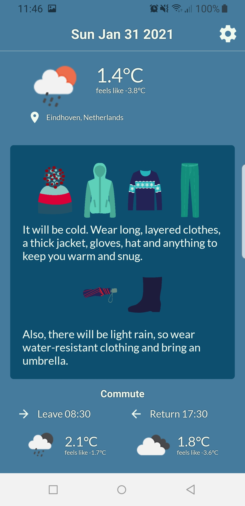
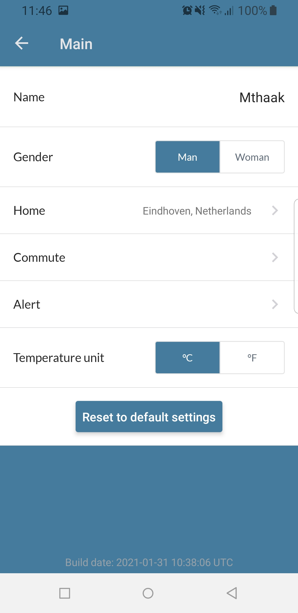
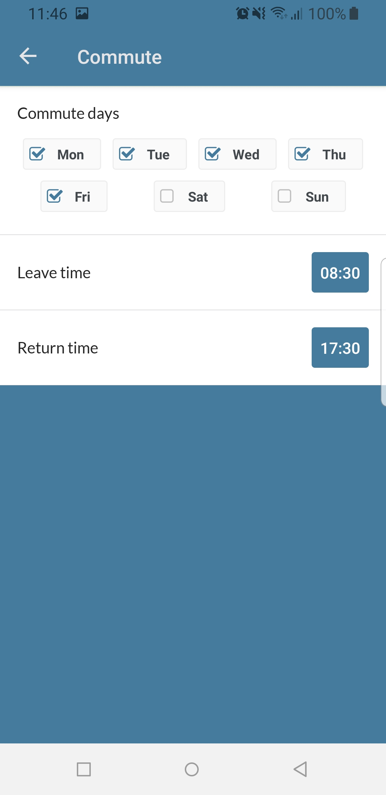

# What should I wear today?
Do you also wonder every morning whether you can wear a skirt or shorts? Or whether you perhaps need to wear a thick jacket because it will be chilly? Or do you want to know about potential rainfall, so you know whether to bring an umbrella?

Well, wonder no more! This app tells you what you can best wear with regards to today's weather. Every morning it sends you a push notification with a summary of the weather and the clothes that go with it. It also takes into account your daily commute, so you will never be surprised by a heavy rain while on the go.

<p align="center">
  
&nbsp; &nbsp; &nbsp; &nbsp;
  
&nbsp; &nbsp; &nbsp; &nbsp;
  
</p>

This app is currently only built for Android. And not released to the Play Store (though it might at some point). Since this is just meant as a hobby project, it doesn't (yet?) have the quality that I deem sufficient to publicly release it.

The weather forecast comes from [OpenWeather](https://openweathermap.org/api).

## Development
This is a React Native app, developed using [Expo](https://expo.io/).

Make sure that NodeJS and the Expo CLI are installed before starting.

### How to set up
- Clone the repo
- Create a `.env` file in the repo root with the following variables (ask me for the values):
```
OPENWEATHERMAP_APPID=<...>
GOOGLE_GEOCODING_API_KEY=<...>
```
- Start Expo from the repo root: `expo start`
- Open the app (follow the Expo instructions). Either:
    - On your phone with the Expo client
    - In your web browser
- Start developing and see the changes reflected automatically in the app

Also have a look at the [amazing documentation](https://docs.expo.io/get-started/installation/) that Expo provides.

### How to build
If you want to build a new version of the Android app, run:
`expo build:android -t apk`

To perform over-the-air (OTA) updates of the built app, run:
`expo publish`

### Style
Use `npx eslint . --fix` to check and fix the style
